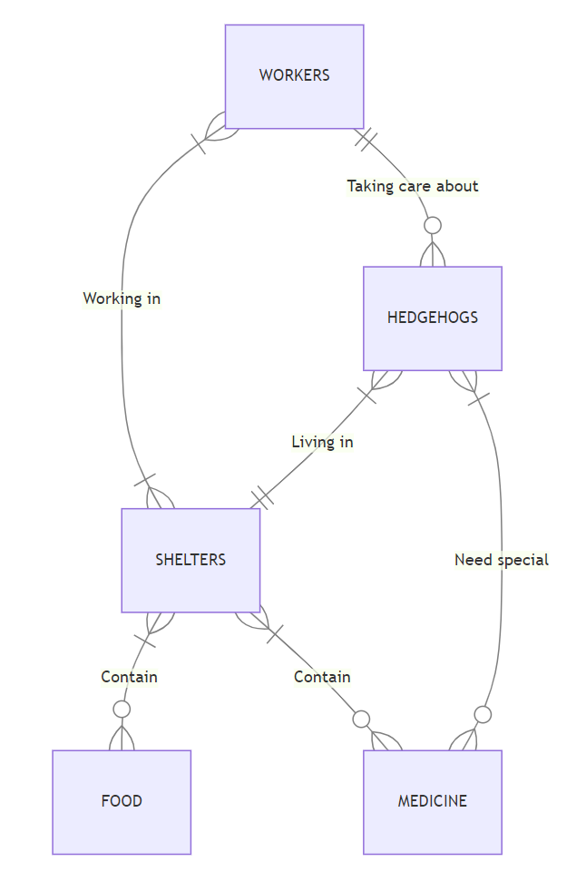

# Design Document

### On the hedge

By Władysław Lewicki

Video overview: <https://youtu.be/qhFl5XjqCWQ>

## Scope

The purpose of the database is to manage information related to workers, shelters, hedgehogs, food, and medicine within a shelter environment. It aims to facilitate the organization and tracking of worker's assignments, hedgehog care, inventory management of food and medicine, and the association between hedgehogs and their respective shelters.

### Included in the Scope:

* Workers: Individuals responsible for caring for hedgehogs and managing shelter operations.
* Shelters: Facilities where hedgehogs are housed and cared for.
* Hedgehogs: Small creatures residing in shelters and receiving care from workers.
* Food: Supplies necessary for feeding hedgehogs within shelters.
* Medicine: Medications used for treating hedgehog's health conditions within shelters.

### Outside the Scope:

* External Personnel: Individuals not directly employed or associated with the shelter, such as veterinarians, volunteers, or visitors.
* Non-Hedgehog Entities: Animals other than hedgehogs that may be present in shelters, such as other mammals, reptiles, or birds.
* Non-Medical Supplies: Items unrelated to hedgehog care, such as shelter infrastructure, administrative supplies, or personal belongings of workers.
* Financial Transactions: Monetary transactions, budgeting, or financial management processes are not within the scope of this database.
* Legal or Regulatory Compliance: Compliance with legal regulations, licensing, or permits specific to shelter operations is not addressed within the database's scope.

## Functional Requirements

The database should enable users to perform the following tasks:

### Manage Workers:

Add, update, and delete worker names.
Assign workers to shelters and hedgehogs for caregiving responsibilities.

### Manage Shelters:

Add, update, and delete shelter details, such as name, location, and funds.

### Manage Hedgehogs:

Add, update, and delete hedgehog records, including their names, ages, and required medicine.

### Manage Food Inventory:

Add, update, and delete food items available in shelters.
Track the quantity of food available and its expiration dates.

### Manage Medicine Inventory:

Add, update, and delete medicine items stocked in shelters.
Track the quantity of medicine available and its expiration dates.

### Association Management:

Manage associations between workers and shelters, workers and hedgehogs, hedgehogs and shelters, and shelters and inventory items (food and medicine).

### Query and Reporting:

Retrieve information about workers, shelters, hedgehogs, food, and medicine for monitoring and reporting purposes.
Generate reports on the status of hedgehog care, inventory levels, and shelter operations.

### Beyond the scope of the database

Beyond the scope of the database, users shouldn't be able to perform tasks unrelated to managing workers, shelters, hedgehogs, food, and medicine within the shelter environment. This includes activities such as financial transactions, legal compliance, or administrative functions. Also, the database does not handle external interactions with personnel or entities outside of the shelter environment.

## Representation

Entities are captured in SQLite tables with the following schema.

### Entities

The database includes the following entities:

#### Workers
The `workers` table includes:

`id`, which specifies the unique ID for the worker as an `INTEGER`. This column thus has the `PRIMARY KEY` constraint applied.
`first_name`, which specifies the worker's first name as TEXT, given TEXT is appropriate for name `fields`.
`last_name`, which specifies the worker's last name. TEXT is used for the same reason as first_name.

#### Hedgehogs
The `hedgehogs` table includes:

* `id`, which specifies the unique ID for the hedgehog as an `INTEGER`. This column thus has the `PRIMARY KEY` constraint applied.
* `name`, which specifies the hedgehog's name as `TEXT`, given `TEXT` is appropriate for name fields.
* `age`, which specifies the age of the hedgehog as `INTEGER`.
* `mass`, which specifies the mass of the hedgehog. `NUMERIC` is used to accommodate various mass values.
* `date_of_placement`, which specifies the date when the hedgehog was placed in the shelter. Timestamps in SQLite can be conveniently stored as `NUMERIC`.

#### Shelters
The `shelters` table includes:

* `id`, which specifies the unique ID for the shelter as an `INTEGER`. This column thus has the `PRIMARY KEY` constraint applied.
* `name`, which specifies the name of the shelter as `TEXT`.
* `country`, which specifies the country where the shelter is located as `TEXT`.
* `city`, which specifies the city where the shelter is located as `TEXT`.
* `ZIP-code`, which specifies the ZIP code of the shelter as `NUMERIC`.
* `address`, which specifies the address of the shelter as `TEXT`.
* `funds`, which specify the funds available for the shelter as `NUMERIC`.

#### Food
The `food` table includes:

* `id`, which specifies the unique ID for the food type as an `INTEGER`. This column thus has the `PRIMARY KEY` constraint applied.
* `name`, which specifies the name of the food type as `TEXT`.
* `comment`, which provides additional comments or descriptions about the food type. The `TEXT` data type is used for flexibility in length.

#### Medicine
The `medicine` table includes:

* `id`, which specifies the unique ID for the medicine type as an `INTEGER`. This column thus has the `PRIMARY KEY` constraint applied.
* `name`, which specifies the name of the medicine type as `TEXT`.
* `comment`, which provides additional comments or descriptions about the medicine type. The `TEXT` data type is used for flexibility in length.

#### Hedgehogs_workers
The `hedgehogs_workers` table includes:

* `id`, which specifies the unique ID for the relationship entry as an `INTEGER`. This column thus has the `PRIMARY KEY` constraint applied.
* `hedgehog_id`, which specifies the ID of the hedgehog being cared for as an `INTEGER`. This column also has a `FOREIGN KEY` constraint applied, referencing the `id` column in the `hedgehogs` table for data integrity.
* `worker_id`, which specifies the ID of the worker caring for the hedgehog as an `INTEGER`. This column also has a `FOREIGN KEY` constraint applied, referencing the `id` column in the `workers` table for data integrity.

#### Shelter_workers
The `shelter_workers` table includes:

* `id`, which specifies the unique ID for the relationship entry as an `INTEGER`. This column thus has the `PRIMARY KEY` constraint applied.
* `shelter_id`, which specifies the ID of the shelter involved in the connection as an `INTEGER`. This column also has a `FOREIGN KEY` constraint applied, referencing the `id` column in the `shelters` table for data integrity.
* `worker_id`, which specifies the ID of the worker involved in the connection as an `INTEGER`. This column also has a `FOREIGN KEY` constraint applied, referencing the `id` column in the `workers` table for data integrity.

#### Hedgehogs_medicine
The `hedgehogs_medicine` table includes:

* `id`, which specifies the unique ID for the relationship entry as an `INTEGER`. This column thus has the `PRIMARY KEY` constraint applied.
* `hedgehog_id`, which specifies the ID of the hedgehog needing the medicine as an `INTEGER`. This column also has a `FOREIGN KEY` constraint applied, referencing the `id` column in the `hedgehogs` table for data integrity.
* `medicine_id`, which specifies the ID of the medicine needed by the hedgehog as an `INTEGER`. This column also has a `FOREIGN KEY` constraint applied, referencing the `id` column in the `medicine` table for data integrity.

#### Hedgehogs_in_shelters
The `hedgehogs_in_shelters` table includes:

* `id`, which specifies the unique ID for the relationship entry as an `INTEGER`. This column thus has the `PRIMARY KEY` constraint applied.
* `hedgehog_id`, which specifies the ID of the hedgehog living in the shelter as an `INTEGER`. This column also has a `FOREIGN KEY` constraint applied, referencing the `id` column in the `hedgehogs` table for data integrity.
* `shelter_id`, which specifies the ID of the shelter where the hedgehog is living as an `INTEGER`. This column also has a `FOREIGN KEY` constraint applied, referencing the `id` column in the `shelters` table for data integrity.

#### Shelters_medicine
The `shelters_medicine` table includes:

* `id`, which specifies the unique ID for the relationship entry as an `INTEGER`. This column thus has the `PRIMARY KEY` constraint applied.
* `shelter_id`, which specifies the ID of the shelter where the medicine is stored as an `INTEGER`. This column also has a `FOREIGN KEY` constraint applied, referencing the `id` column in the `shelters` table for data integrity.
* `medicine_id`, which specifies the ID of the medicine stored in the shelter as an `INTEGER`. This column also has a `FOREIGN KEY` constraint applied, referencing the `id` column in the `medicine` table for data integrity.
* `amount`, which specifies the quantity of the medicine available in the shelter.
* `expires`, which specifies the expiry date of the medicine. This column is marked as `NOT NULL` to ensure the expiry date is always provided.

#### Shelters_food
The `shelters_food` table includes:

* `id`, which specifies the unique ID for the relationship entry as an `INTEGER`. This column thus has the `PRIMARY KEY` constraint applied.
* `shelter_id`, which specifies the ID of the shelter where the food is stored as an `INTEGER`. This column also has a `FOREIGN KEY` constraint applied, referencing the `id` column in the `shelters` table for data integrity.
* `food_id`, which specifies the ID of the food stored in the shelter as an `INTEGER`. This column also has a `FOREIGN KEY` constraint applied, referencing the `id` column in the `food` table for data integrity.
* `amount`, which specifies the quantity of the food available in the shelter.
* `expires`, which specifies the expiry date of the food. This column is marked as `NOT NULL` to ensure the expiry date is always provided.

### Relationships

The below entity relationship diagram describes the relationships among the entities in the database.

As detailed by the diagram:

* Each worker can work in 1 to many shelters, while each shelter can have 1 to many workers working in it. This represents a many-to-many relationship between workers and shelters.

* Each hedgehog can live only in 1 shelter, and each shelter can house 1 to many hedgehogs. This depicts a one-to-many relationship between hedgehogs and shelters.

* Workers can take care of 0 to many hedgehogs, and hedgehogs can be taken care of by 1 worker. This signifies a many-to-one relationship between workers and hedgehogs.

* Each shelter can contain 0 to many types of food, and each type of food can be contained in 1 to many shelters. This illustrates a many-to-many relationship between shelters and food.

* Similarly, each shelter can contain 0 to many types of medicine, and each type of medicine can be contained in 1 to many shelters. This also represents a many-to-many relationship between shelters and medicine.

* Hedgehogs may need 0 to many types of special medicine, and each type of special medicine can be needed by 0 to many hedgehogs. This denotes a many-to-many relationship between hedgehogs and special medicine.

## Optimizations

I have created views to decrease the complexity of the most common queries:

* `hedgehogs_workers_in_shelters_view` as joined tables `hedgehogs`, `hedgehogs_workers`, `shelter_workers`, `shelters` and `workers`,

* `food_in_shelters_view` as joined tables `shelters_food`, `food` and `shelters`,

* `hedgehogs_medicine_in_shelters_view` as joined tables `shelters_medicine`, `medicine`,
`shelters`, `hedgehogs_medicine` and `hedgehogs`.

And indexes:

* `hedgehogs_names` on `hedgehogs` (`name`),

* `shelters_names` on `shelters` (`name`),

* `workers_names` on `workers` (`first_name`, `last_name`),

* `hedgehogs_of_workers` on `hedgehogs_workers` (`worker_id`),

* `workers_in_shelters` on `shelter_workers` (`shelter_id`),

* `hedgehogs_shelters` on `hedgehogs_in_shelters` (`shelter_id`),

* `food_expires` on `shelters_food` (`expires`),

* `medicine_expires` on `shelters_medicine` (`expires`),

* `medicine_for_hedgehogs` on `hedgehogs_medicine` (`hedgehog_id`).

To increase speed for most common search according to 'queries.sql'.

## Limitations

The current schema contains very simple relations between workers and shelters, workers and hedgehogs. So schema doesn't contain the worker's calendar and salary. Also, the schema doesn't contain financial transactions, legal compliance, administrative functions, interactions with veterinarians and volunteers and other external interactions.
