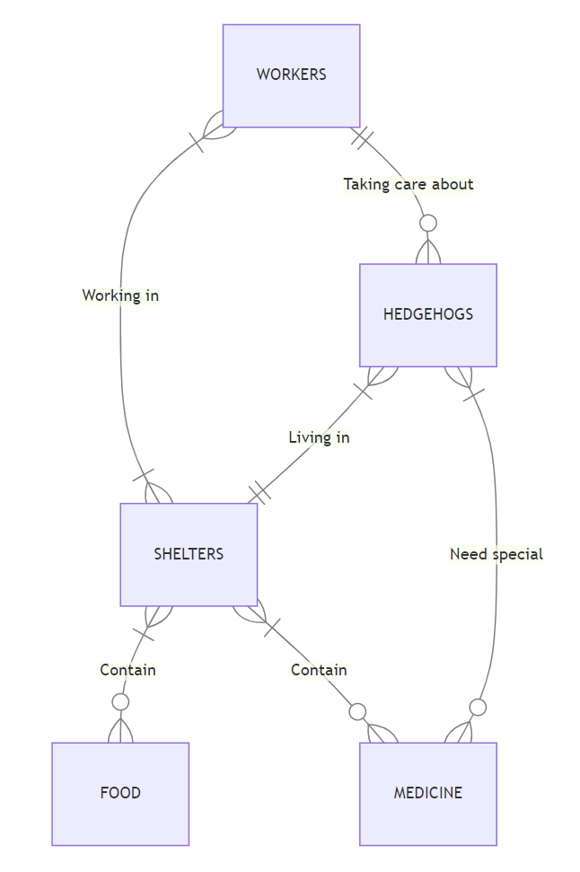

### On the hedge

By Władysław Lewicki

Video overview: <https://youtu.be/qhFl5XjqCWQ>

## Scope

The purpose of the database is to manage information related to workers, shelters, hedgehogs, food, and medicine within a shelter environment. It aims to facilitate the organization and tracking of worker's assignments, hedgehog care, inventory management of food and medicine, and the association between hedgehogs and their respective shelters.

## Files

* 'Design.md' contains comments about database design.
* 'ER_diagram' shows the entity-relationship diagram.
* 'on_the_hedge' database file
* 'queries' contains example queries.
* 'schema' contains all queries that create a database.
* 'test_data_insert' queries for inserting some raw data.
  
## Relationships
The below entity relationship diagram describes the relationships among the entities in the database.

